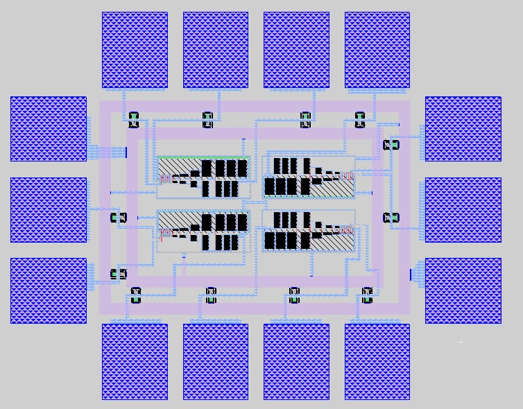

# CD4011 CMOS NAND Gate

This project is an implementation of a NAND gate in **TSMC 180nm** technology. It serves as a fundamental building block of the classic CD4011 logic IC.

## Specifications
- **Technology:** TSMC 180nm
- **Supply Voltage:** 1.8V
- **Logic Function:** 2-Input NAND
- **Tools used:** SPICE, Magic VLSI

## Project Flow
1. Transistor-level design (Schematic and SPICE simulations).
2. Output buffer design (multi-stage tapered buffer).
3. Layout implementation in Magic VLSI.
4. Verification and Design Rule Check (DRC).

## Layout Preview

